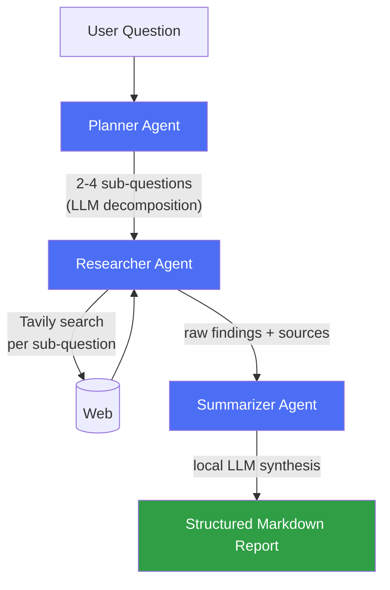

# 🔬 Multi-Agent Research Assistant

**A multi-agent AI system that plans, researches, and synthesizes answers to open-ended questions — running entirely on a local LLM.**

Given a research question, three cooperating agents (Planner, Researcher, Summarizer) break it down, gather real information from the web, and write a structured Markdown report with cited sources — no OpenAI/Anthropic API key required.

Built with **LangGraph**, **FastAPI**, and **Ollama**.

---

## Why this project

Most "AI chatbot" demos are a single LLM call with a system prompt. This project is different: it's a small **team of agents with distinct responsibilities**, coordinated through an explicit state graph, calling a real external tool (Tavily search), with retry/failure handling so the pipeline degrades gracefully instead of crashing when a tool call fails.

## Architecture



Each agent is a node in a **LangGraph** `StateGraph`. State (`ResearchState`) flows through the pipeline: `query → sub_questions → findings → report`. This is deliberately explicit rather than a single prompt chain — each agent's input/output is typed and independently testable.

## Example

**Request:**
```bash
curl -X POST http://localhost:8000/research \
  -H "Content-Type: application/json" \
  -d '{"query": "What are the health benefits of green tea?"}'
```

**What happens under the hood:**
1. **Planner** decomposes the question into sub-questions, e.g.:
   - *What are the primary bioactive compounds found in green tea?*
   - *How do these compounds contribute to weight loss and obesity prevention?*
   - *Can regular consumption of green tea reduce the risk of certain diseases?*
2. **Researcher** runs a real web search (Tavily) for each sub-question and collects sourced findings
3. **Summarizer** synthesizes everything into one Markdown report, with sections like Antioxidant Properties, Heart Health, Medication Interactions, and a References list citing real sources

## Tech stack

| Layer | Choice | Why |
|---|---|---|
| Orchestration | [LangGraph](https://langchain-ai.github.io/langgraph/) | Explicit state graph over agents, not a black-box chain |
| API | FastAPI | Async, typed, auto-generated docs |
| LLM | Ollama (local) | No API key, fully self-hosted inference |
| Web search | [Tavily](https://tavily.com) | Purpose-built search API for AI agents, structured results |
| Config | Pydantic Settings | Typed, `.env`-driven configuration |
| Tests | Pytest | Fast, dependency-free unit tests on core logic |

## Project layout
## Setup

1. Install [Ollama](https://ollama.com) and pull a model:
```bash
   ollama pull llama3.1
```
2. Get a free [Tavily API key](https://tavily.com) (no credit card required)
3. Clone and install:
```bash
   git clone https://github.com/veenatanneeru/multi-agent-research-assistant.git
   cd multi-agent-research-assistant
   python -m venv venv && source venv/bin/activate
   pip install -r requirements.txt
   cp .env.example .env   # then add your TAVILY_API_KEY
```
4. Run it:
```bash
   uvicorn app.main:app --reload
```
5. Test it:
```bash
   curl -X POST http://localhost:8000/research \
     -H "Content-Type: application/json" \
     -d '{"query": "What are the latest trends in small modular nuclear reactors?"}'
```

## Running tests

```bash
pytest tests/ -v
```

## Roadmap

- [x] LangGraph pipeline: Planner → Researcher → Summarizer
- [x] Real web search via Tavily with graceful failure handling
- [x] LLM-based query decomposition (multi-step planning)
- [x] Unit tests for core parsing logic
- [ ] MCP integration — expose search/fetch as MCP tools
- [ ] RAG layer over user-uploaded documents
- [ ] Streaming responses
- [ ] Dockerfile + deployment guide

## License

MIT
